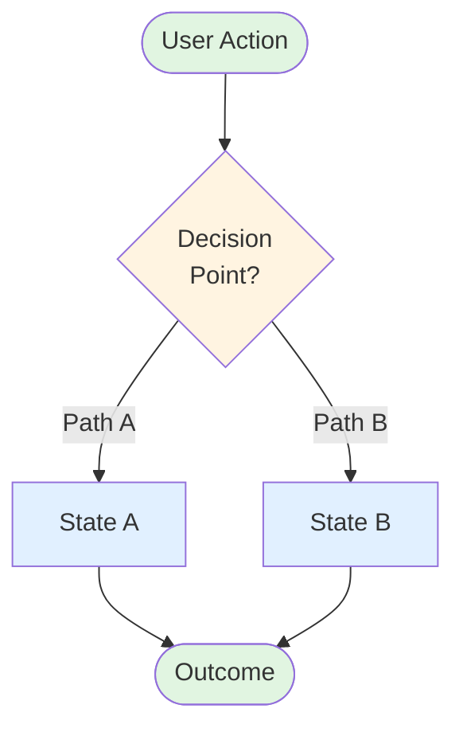

# [Feature Name]

## Overview

[2-3 sentences describing the feature for PM/stakeholders. What problem does it solve?]

**Target Audience:** [Product Managers | Developers | Both]

## 🎯 What It Does

[Plain language explanation of the problem and the solution this feature provides. Make it understandable for non-technical stakeholders.]

**Key Point:** [One sentence summarizing the most important aspect]

## 📊 [Feature] Flow Diagram

**Style Guide for Diagrams:**

- Green nodes (#e1f5e1): User actions, final outcomes
- Blue nodes (#e1f0ff): System states, operations
- Yellow nodes (#fff4e1): Decision points, conditions
- Red nodes (#ffe1e1): Error states (if applicable)

## 🔄 Detailed Flow Steps

### Step 1: [Initial State/Action]

[Detailed description of what happens first]

**Decision Point:** [What choice is made here?]

### Step 2A: [First Path]

[Description of this path]

### Step 2B: [Alternative Path]

[Description of alternative path]

### Step 3: [Final State]

[How things conclude]

## 🎨 User Experience

### What Users See

[Describe the visible behavior and UI changes]

### What Users Control

[List user actions and their effects]

### Visual Indicators

[Any badges, notifications, loading states, etc.]

## ⚙️ Technical Details (For Developers)

### Architecture

[High-level technical design]

### Key Components

[List of files/components involved]

### State Management

[How state is managed - React Query, context, etc.]

### Performance Considerations

[Caching, optimization, memory usage]

## 📋 Decision Points Summary

| Condition     | Action         | Result    |
| ------------- | -------------- | --------- |
| [Condition 1] | [What happens] | [Outcome] |
| [Condition 2] | [What happens] | [Outcome] |

## 🎯 Key Behaviors

### Normal Operation

- [Behavior 1]
- [Behavior 2]

### Edge Cases Handled

1. **[Edge Case 1]:**
   - [How it's handled]
2. **[Edge Case 2]:**
   - [How it's handled]

## 🔍 Error Handling

[Describe how errors are caught and displayed to users]

## 📝 Notes for Product Team

### What This Means for Users

- [User impact 1]
- [User impact 2]

### What This Means for Product

- [Product capability or constraint]
- [Scalability consideration]

### Future Considerations

- [Potential enhancement]
- [Related feature opportunity]

---

**Last Updated:** [Date]  
**Author:** [Name]  
**Related PRs:** [Links if applicable]
